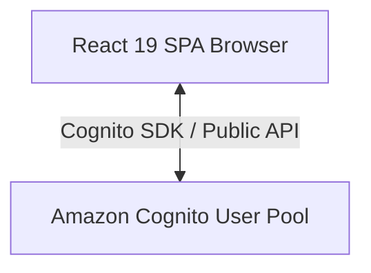
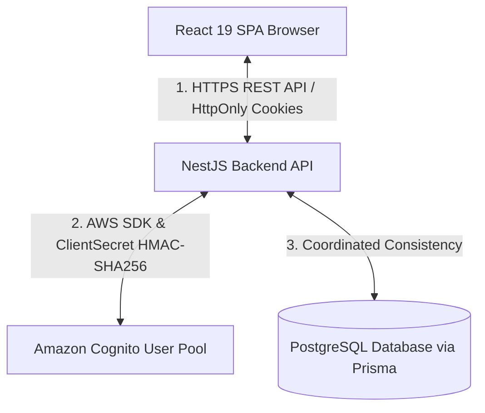
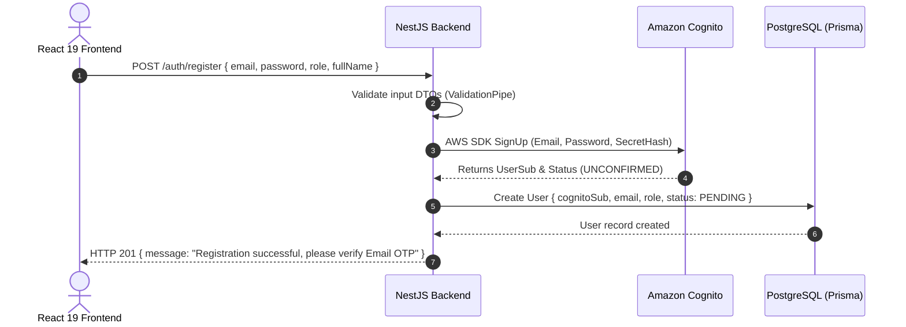
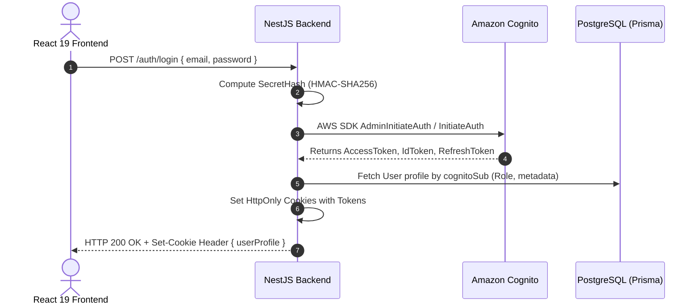

## 1. Introduction

In modern web application design, Identity Management and User Authentication represent critical architectural components demanding high security rigor.

For the **Startups Blogs** platform (a digital ecosystem connecting Startups, Business Owners, Investors, and Strategic Enterprise Partners), the tech stack comprises:

- **Frontend:** React 19 (Vite, TypeScript)
- **Backend:** NestJS REST API
- **Authentication Service:** Amazon Cognito User Pool
- **Database & ORM:** PostgreSQL managed via Prisma ORM

When integrating Amazon Cognito into a React application, a fundamental architectural question arises: **Should the browser-based React application communicate directly with Amazon Cognito, or should all authentication operations be mediated through a trusted NestJS backend server?**

In this article, I present a detailed breakdown of our architectural decision to adopt a **Backend-Mediated Authentication Architecture** for the Startups Blogs project. I discuss technical rationales, security risks surrounding Client Secrets and Tokens, and strategies for coordinating identity data between Amazon Cognito and our PostgreSQL database.

---

## 2. Architecture Comparison

### Approach A – Direct Browser Integration

- **How it works:** The browser-based React application uses `amazon-cognito-identity-js` or AWS Amplify SDK to interact directly with Cognito endpoints (`SignUp`, `InitiateAuth`, `ConfirmSignUp`).
- **When it is appropriate:** This architecture is legitimate and officially supported by AWS when utilizing a **Cognito Public App Client** (configured without a Client Secret). It suits simple serverless applications or pure SPAs that do not require server-side database coordination.
- **Limitations for Startups Blogs:**
  - Cannot protect a Client Secret if confidential client operations are needed.
  - Complicates real-time user profile synchronization with PostgreSQL business data.
  - Relies on storing tokens directly in client storage (`localStorage` / `sessionStorage`).

### Approach B – Backend-Mediated Authentication

- **How it works:** The React frontend sends authentication requests (`POST /auth/login`, `POST /auth/register`) over secure HTTPS to the NestJS backend. NestJS acts as a trusted client server, calling AWS SDK methods to Cognito, managing application business logic, and returning responses to React.
- **Layer Responsibilities:**
  - **React 19 Frontend:** Renders UI, handles form input state, displays user session status, and executes API requests.
  - **NestJS Backend:** Manages server-side secret configurations (`COGNITO_CLIENT_SECRET`), computes `SecretHash` values, executes AWS SDK calls to Cognito, persists business user records in PostgreSQL via Prisma, and configures security cookies.
  - **Amazon Cognito:** Acts as the centralized Identity Provider (IdP) managing accounts, credentials, password encryption, email OTP verifications, and RSA-signed JWT issuance.
  - **PostgreSQL / Prisma:** Stores extended business domain entities (roles: `BUSINESS_OWNER`, `INVESTOR`, `ENTERPRISE_PARTNER`, company profiles, articles).

_Figure 1. Cognito Authentication Architecture Comparison (Direct Browser Integration vs. Backend-Mediated)._

---

## 3. Protecting the Cognito Client Secret

In Amazon Cognito, when creating an App Client, developers choose between two client types:

1. **Public Client:** Created without a `Client Secret`.
2. **Confidential Client:** Created with a `Client Secret` bound to a `Client ID`.

### Distinguishing Client ID vs. Client Secret

- `COGNITO_CLIENT_ID`: A public identifier for the application client. This value is non-sensitive and can be exposed in client-side code.
- `COGNITO_CLIENT_SECRET`: A confidential cryptographic secret used to authenticate that requests originating from the client server are authorized. **This value MUST remain strictly confidential.**

### Why Client Secrets Must Never Exist in React Source Code

React applications (Single Page Applications) are compiled into JavaScript bundles downloaded and executed entirely within the end-user's web browser. Anyone can inspect client-side assets using:

- Browser Developer Tools (Network and Application tabs).
- Decompiling JavaScript bundles (`main.js`, `vendor.js`).
- Utilizing Source Maps to reconstruct original source files.

If `COGNITO_CLIENT_SECRET` is embedded into React source code (even as a client-side `.env` variable), malicious actors can easily extract the secret and spoof the application client to launch brute-force attacks or abuse Cognito APIs.

In Startups Blogs, `COGNITO_CLIENT_SECRET` resides exclusively within the **NestJS Backend** environment configuration (managed via `@nestjs/config` and loaded from server process environments).

---

## 4. Token Storage and XSS / CSRF Security Considerations

Upon successful authentication, Amazon Cognito issues three JWT token types:

- **`AccessToken`**: Authorizes access to system APIs and protected resources.
- **`IdToken`**: Contains user identity claims (`sub`, `email`, `email_verified`).
- **`RefreshToken`**: Used to acquire fresh `AccessToken` instances without forcing re-login.

### Risks of `localStorage` Token Storage

Storing sensitive tokens directly in `localStorage` or `sessionStorage` exposes them to Cross-Site Scripting (XSS) vulnerabilities. Any malicious JavaScript executing on the page (from compromised third-party packages or injected scripts) can read stored tokens (`localStorage.getItem('access_token')`).

### Mitigation via `HttpOnly Cookies`

To mitigate token exfiltration risks, NestJS receives tokens from Cognito and encapsulates them within **HttpOnly Cookies** delivered to the browser:

- **`HttpOnly` Attribute:** Completely prevents client-side JavaScript from reading cookie values (`document.cookie` cannot inspect the tokens).
- **`Secure` Attribute:** Mandates that cookies are transmitted exclusively over encrypted HTTPS connections.
- **`SameSite=Lax` or `Strict` Attribute:** Controls cross-site cookie transmission, reducing Cross-Site Request Forgery (CSRF) vectors.

> ⚠️ **Important Technical Note on XSS and CSRF:**
> `HttpOnly` cookies **do not eliminate XSS risks entirely**. `HttpOnly` specifically prevents _direct script-based token exfiltration_. If an XSS vulnerability exists, an attacker can still issue authenticated requests through the victim's browser. Therefore, defense-in-depth measures—including strict input sanitization, Content Security Policies (CSP), and CSRF tokens where applicable—remain essential.

---

## 5. Registration Flow

When a user registers for an account on Startups Blogs:

---

## 6. Login Flow

The React browser receives the success payload and stores basic user metadata in Zustand (`authStore`), while sensitive authentication tokens remain secured inside HttpOnly cookies.

---

## 7. Verification Flow

Following registration, users receive a 6-digit OTP code via email dispatched by Cognito:

1. The user inputs the OTP code at `PendingVerification.tsx` and submits `POST /auth/confirm-email`.
2. NestJS calculates `SecretHash` and invokes `ConfirmSignUp` via the AWS SDK.
3. Upon Cognito confirmation, the account status transitions to `CONFIRMED`.
4. NestJS updates the corresponding database record status in PostgreSQL to `ACTIVE`.
5. Centralizing validation within NestJS standardizes error responses (e.g., `CodeMismatchException`, `ExpiredCodeException`) into consistent JSON payloads for the frontend.

---

## 8. Refresh Token Flow

When an `AccessToken` expires (typically after 1 hour):

1. Upon subsequent requests, NestJS `AuthGuard` detects token expiration.
2. NestJS extracts `RefreshToken` from the secure HttpOnly cookie and executes `AdminInitiateAuth` (`REFRESH_TOKEN_AUTH` flow) to Cognito.
3. Cognito issues new `AccessToken` and `IdToken` instances.
4. NestJS updates the HttpOnly cookies seamlessly, maintaining an uninterrupted user session experience.

---

## 9. Logout Flow

When a user initiates logout:

1. React submits `POST /auth/logout` to NestJS.
2. NestJS invalidates and clears the HttpOnly authentication cookies.
3. Optionally, NestJS issues a `GlobalSignOut` command to Amazon Cognito to revoke all active Refresh Tokens across devices.
4. React clears user session state from Zustand and redirects to the landing page.

---

## 10. Synchronizing Cognito and PostgreSQL: "Coordinated Consistency"

When coordinating identity data between Amazon Cognito and PostgreSQL, system architecture concepts must be stated precisely.

> ⚠️ **Technical Correction on Distributed Transactions:**
> Amazon Cognito (an independent AWS managed cloud service) and PostgreSQL (a relational database) are **two separate distributed systems**. Account registration across both services cannot form a traditional single **ACID Distributed Transaction** (there is no 2-Phase Commit mechanism between Cognito and PostgreSQL).

Instead, our architecture implements **Coordinated Consistency (Application-Level Consistency)** using robust error compensation strategies:

- **Execution Order:** Create user in Cognito (`SignUp`) -> Retrieve `cognitoSub` -> Create corresponding User entity in PostgreSQL.
- **Compensation Logic:** If PostgreSQL persistence fails (e.g., database timeout), NestJS triggers compensation routines by executing `AdminDeleteUser` on Cognito to eliminate orphaned accounts.
- **Explicit State Management:** Database records initialize in a `PENDING_VERIFICATION` state and transition to `ACTIVE` only after dual confirmation.
- **Idempotent Design:** Synchronization APIs are designed to be idempotent based on the immutable `cognitoSub` key.

---

## 11. Advantages and Architectural Trade-offs

### Advantages of Backend-Mediated Authentication:

- **Absolute Secret Protection:** `COGNITO_CLIENT_SECRET` remains fully isolated on the server.
- **Centralized Logic & Validation:** Business validation rules, authorization logic, and error sanitization reside in NestJS.
- **Mitigated Token Exposure:** HttpOnly Cookies prevent direct JavaScript access to authentication tokens.
- **Seamless Data Synchronization:** Easily links Cognito identity UUIDs with complex PostgreSQL domain models.
- **Enhanced Observability:** Enables centralized audit logging and security monitoring on the backend.

### Architectural Trade-offs:

- **Increased Backend Codebase:** Requires writing additional Controllers, Services, DTOs, and Guards in NestJS.
- **Extra Network Hop:** Request flows from Client -> NestJS -> Cognito introduce a minor additional latency hop compared to direct client calls.
- **High Availability Dependency:** The NestJS backend becomes a critical dependency for authentication availability.

---

## 12. Security Checklist

When implementing Cognito authentication mediated via NestJS, our team recommends adhering to this security checklist:

- [x] **Never Expose Client Secret:** Store `COGNITO_CLIENT_SECRET` strictly in server-side environments.
- [x] **Enforce HTTPS:** Require TLS/HTTPS for all Client-to-Backend and Backend-to-AWS traffic.
- [x] **Configure Secure Cookies:** Set `HttpOnly`, `Secure`, and `SameSite=Lax/Strict` flags on auth cookies.
- [x] **Apply Rate Limiting:** Implement `@nestjs/throttler` to prevent brute-force attacks on auth endpoints.
- [x] **Cryptographically Verify JWTs:** Validate RSA signatures and claims (`exp`, `iss`, `aud`, `token_use`) on the backend.
- [x] **Least-Privilege IAM Roles:** Restrict backend AWS IAM permissions strictly to required Cognito actions.
- [x] **Prevent Sensitive Logging:** Never log raw credentials, tokens, or client secrets in server logs.

---

## 13. Conclusion

The **Backend-Mediated Authentication Architecture** utilizing React 19, NestJS, Amazon Cognito, and PostgreSQL represents a balanced, secure architecture choice for **Startups Blogs**. This pattern protects confidential client secrets, mitigates token exfiltration vectors, and maintains reliable data consistency across identity and application databases.

---

### Key Takeaways

1. **Client Secrets Are Confidential:** Never embed `COGNITO_CLIENT_SECRET` within frontend React applications.
2. **HttpOnly Cookies Mitigate Token Theft:** Encapsulating JWTs in HttpOnly cookies prevents JavaScript from directly accessing token strings.
3. **Coordinated Consistency:** Cognito and PostgreSQL are independent storage systems requiring application-level consistency mechanisms and compensation logic rather than ACID transactions.
4. **Balanced Architecture:** Backend mediation enhances security control while adding a minor network hop and additional backend service maintenance.

---

### Authentication Security Series

- **Part 1: Why Should Authentication Requests Go Through the Backend? – Amazon Cognito with React and NestJS**
- [Part 2: Securing Amazon Cognito Authentication: SecretHash and JWT Signature Verification – Part 2](../3.2-blog2/)
- [Part 3: Secure Session Management: HttpOnly Cookies, Refresh Tokens, and RBAC – Part 3](../3.3-blog3/)

---

### Original Post

[View the original post on Facebook](https://www.facebook.com/photo?fbid=1059870426748877&set=gm.2242620649836228&idorvanity=660548818043427)

