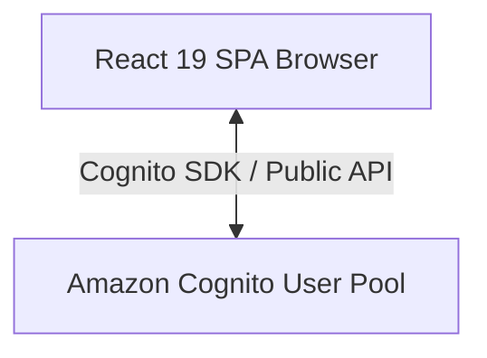
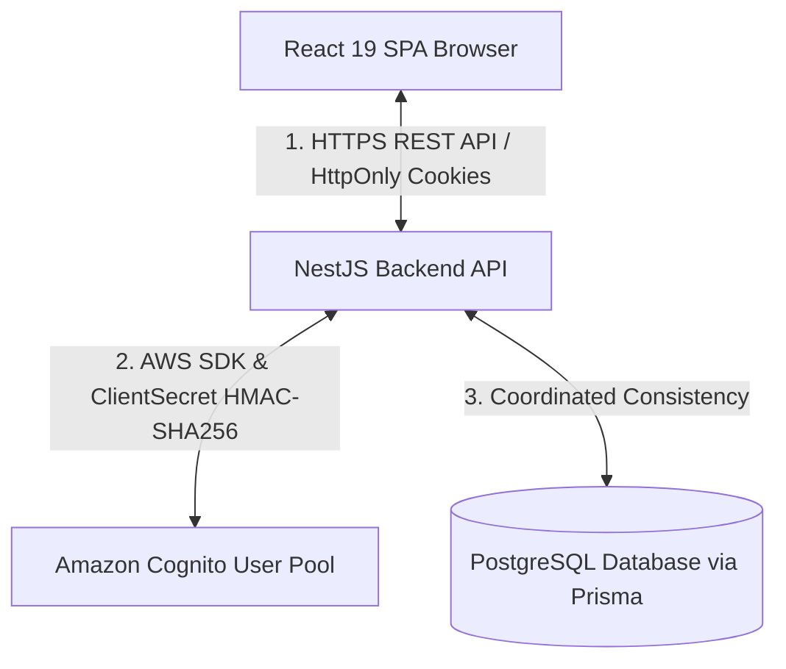
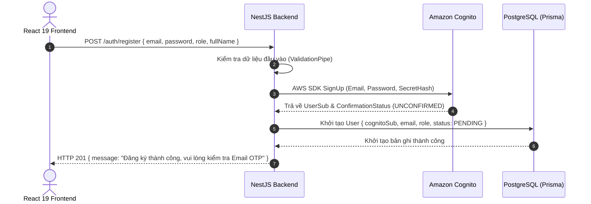
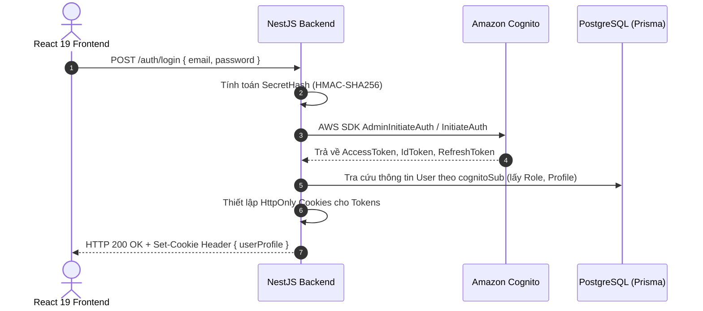

## 1. Giới thiệu bài viết

Trong thiết kế ứng dụng web hiện đại, quản lý danh tính (Identity Management) và xác thực người dùng (Authentication) là một trong những thành phần quan trọng hàng đầu, đòi hỏi sự cẩn trọng cao độ về mặt bảo mật.

Đối với nền tảng **Startups Blogs** (Hệ thống kết nối Doanh nghiệp khởi nghiệp, Nhà đầu tư và Đối tác chiến lược), ứng dụng được phát triển trên bộ công nghệ:

- **Frontend:** React 19 (Vite, TypeScript)
- **Backend:** NestJS REST API
- **Authentication Service:** Amazon Cognito User Pool
- **Database & ORM:** PostgreSQL kết hợp Prisma ORM

Khi tích hợp Amazon Cognito vào ứng dụng React, một câu hỏi kiến trúc cơ bản thường được đặt ra: **Nên để ứng dụng React ở trình duyệt giao tiếp trực tiếp với Amazon Cognito, hay mọi thao tác xác thực phải được điều hướng qua server trung gian NestJS?**

Trong bài viết này, em xin chia sẻ chi tiết về quyết định lựa chọn mô hình xác thực qua Backend trung gian (**Backend-Mediated Authentication Architecture**) trong dự án Startups Blogs, phân tích rõ lý do kỹ thuật, các rủi ro bảo mật liên quan đến Client Secret và Token, cũng như quy trình phối hợp dữ liệu giữa Amazon Cognito và cơ sở dữ liệu PostgreSQL.

---

## 2. So sánh hai mô hình kiến trúc xác thực

### Mô hình A – Gọi trực tiếp từ Browser (Direct Browser Integration)

- **Cách vận hành:** Trình duyệt React sử dụng `amazon-cognito-identity-js` hoặc AWS Amplify SDK để gọi trực tiếp các API của Cognito (`SignUp`, `InitiateAuth`, `ConfirmSignUp`).
- **Trường hợp áp dụng hợp lệ:** Mô hình này hoàn toàn hợp lệ và được AWS hỗ trợ chính thức khi sử dụng **Cognito Public App Client** (không cài đặt Client Secret). Phù hợp với các ứng dụng Serverless đơn giản hoặc SPA thuần túy không yêu cầu xử lý dữ liệu nghiệp vụ phía server.
- **Hạn chế đối với dự án Startups Blogs:**
  - Không thể bảo vệ Client Secret nếu ứng dụng yêu cầu Confidential Client.
  - Khó khăn trong việc đồng bộ ngay lập tức hồ sơ người dùng vào cơ sở dữ liệu nghiệp vụ PostgreSQL.
  - Phụ thuộc vào việc lưu trữ Token tại trình duyệt (`localStorage` / `sessionStorage`).

### Mô hình B – Xác thực qua Server trung gian (Backend-Mediated Authentication)

- **Cách vận hành:** Trình duyệt React gửi yêu cầu xác thực (`POST /auth/login`, `POST /auth/register`) đến NestJS Backend qua kết nối HTTPS an toàn. NestJS đóng vai trò là client tin cậy (Trusted Server), thực hiện gọi AWS SDK đến Cognito, sau đó xử lý logic nghiệp vụ và trả kết quả về cho React.
- **Trách nhiệm của từng tầng:**
  - **React 19 Frontend:** Quản lý giao diện, thu thập dữ liệu form, hiển thị trạng thái đăng nhập và gửi request API.
  - **NestJS Backend:** Quản lý biến môi trường bảo mật (`COGNITO_CLIENT_SECRET`), tính toán mã xác thực `SecretHash`, gọi Cognito API, ghi dữ liệu người dùng vào PostgreSQL qua Prisma và thiết lập cookie bảo mật.
  - **Amazon Cognito:** Đóng vai trò Identity Provider (IdP) quản lý tài khoản, mật khẩu, mã hóa credentials, xác thực OTP email và phát hành chữ ký số JWT.
  - **PostgreSQL / Prisma:** Lưu trữ các thuộc tính nghiệp vụ mở rộng (vai trò `BUSINESS_OWNER`, `INVESTOR`, `ENTERPRISE_PARTNER`, thông tin doanh nghiệp, bài viết).

_Hình 1. So sánh Kiến trúc Xác thực Cognito (Trực tiếp từ Trình duyệt vs. Qua Server trung gian NestJS)._

---

## 3. Bảo vệ Cognito Client Secret

Trong Amazon Cognito, khi tạo một App Client cho ứng dụng, bạn có hai lựa chọn:

1. **Public Client:** Không có `Client Secret`.
2. **Confidential Client:** Có tạo `Client Secret` đi kèm với `Client ID`.

### Phân biệt Client ID và Client Secret

- `COGNITO_CLIENT_ID`: Định danh công khai của ứng dụng client. Giá trị này không nhạy cảm và có thể xuất hiện trong mã nguồn phía client.
- `COGNITO_CLIENT_SECRET`: Khóa bí mật dùng để xác thực rằng request gửi tới Cognito xuất phát từ một server tin cậy được ủy quyền. **Giá trị này bắt buộc phải giữ bí mật tuyệt đối.**

### Tại sao không bao giờ đưa Client Secret vào mã nguồn React?

Mã nguồn ứng dụng React (Single Page Application) sau khi đóng gói (build bundle) sẽ được tải về và thực thi hoàn toàn trên trình duyệt của người dùng cuối. Bất kỳ ai cũng có thể trích xuất thông tin bí mật thông qua:

- Công cụ kiểm tra trình duyệt (Browser Developer Tools / Network Tab).
- Phân tích các file JavaScript bundle (`main.js`, `vendor.js`).
- Sử dụng Source Maps để khôi phục mã nguồn ban đầu.

Nếu đưa `COGNITO_CLIENT_SECRET` vào mã nguồn React (dù khai báo dưới dạng biến môi trường `.env` phía client), kẻ tấn công có thể dễ dàng lấy được bí mật này và giả mạo client ứng dụng để thực hiện các cuộc tấn công Brute Force hoặc lạm dụng API Cognito.

Trong dự án Startups Blogs, biến môi trường `COGNITO_CLIENT_SECRET` chỉ tồn tại duy nhất trên môi trường server của **NestJS Backend** (được quản lý qua `@nestjs/config` và đọc từ biến môi trường của hệ thống).

---

## 4. Quản lý Token và phân tích rủi ro XSS / CSRF

Khi xác thực thành công, Amazon Cognito sẽ phát hành 3 loại token dạng JWT:

- **`AccessToken`**: Dùng để ủy quyền truy cập vào các tài nguyên và API của hệ thống.
- **`IdToken`**: Chứa thông tin nhận dạng người dùng (`sub`, `email`, `email_verified`).
- **`RefreshToken`**: Dùng để gia hạn `AccessToken` mới khi token cũ hết hạn mà không bắt người dùng đăng nhập lại.

### Rủi ro khi lưu Token trong `localStorage`

Nếu lưu trữ Token trực tiếp trong `localStorage` hoặc `sessionStorage` của trình duyệt, bất kỳ đoạn mã JavaScript độc hại nào thực thi trên trang (thông qua lỗ hổng Cross-Site Scripting - XSS từ thư viện bên thứ ba hoặc script chèn trái phép) đều có thể truy cập, đọc và đánh cắp các token này (`localStorage.getItem('access_token')`).

### Giải pháp lưu trữ bằng `HttpOnly Cookie`

Để hạn chế rủi ro thất thoát token do XSS, NestJS Backend nhận token từ Cognito và lưu trữ chúng vào **HttpOnly Cookie** gửi về trình duyệt:

- **Thuộc tính `HttpOnly`:** Ngăn chặn tuyệt đối mã JavaScript chạy trên trình duyệt truy cập hoặc đọc giá trị của Cookie (`document.cookie` sẽ không chứa token).
- **Thuộc tính `Secure`:** Đảm bảo Cookie chỉ được trình duyệt gửi qua kết nối mã hóa HTTPS.
- **Thuộc tính `SameSite=Lax` hoặc `Strict`:** Giúp kiểm soát ngữ cảnh gửi cookie giữa các domain, giảm thiểu rủi ro tấn công Cross-Site Request Forgery (CSRF).

> ⚠️ **Lưu ý kỹ thuật quan trọng về XSS và CSRF:**
> Thuộc tính `HttpOnly` **không loại bỏ hoàn toàn nguy cơ tấn công XSS**. `HttpOnly` chỉ ngăn chặn việc _đánh cắp trực tiếp chuỗi token_ ra khỏi trình duyệt. Nếu một lỗ hổng XSS xảy ra, kẻ tấn công vẫn có thể mạo danh trình duyệt người dùng để gửi các request có gắn kèm cookie tự động. Do đó, hệ thống cần áp dụng phòng thủ nhiều lớp (Defense in Depth), bao gồm Sanitization đầu vào, thiết lập Content Security Policy (CSP) và sử dụng cơ chế bảo vệ CSRF (CSRF Tokens) phù hợp khi dùng Cookie-based authentication.

---

## 5. Quy trình Đăng ký tài khoản (Registration Flow)

Khi người dùng thực hiện đăng ký tài khoản mới trên ứng dụng Startups Blogs:

---

## 6. Quy trình Đăng nhập (Login Flow)

Trình duyệt React nhận phản hồi thành công và lưu trữ thông tin profile cơ bản vào Zustand `authStore`, trong khi các token nhạy cảm nằm an toàn bên trong HttpOnly Cookie.

---

## 7. Quy trình Xác thực Email OTP (Verification Flow)

Sau khi đăng ký, người dùng nhận mã OTP 6 chữ số qua Email gửi từ Amazon Cognito:

1. Người dùng nhập mã OTP tại giao diện `PendingVerification.tsx` và gửi request `POST /auth/confirm-email`.
2. NestJS Backend tính toán `SecretHash` và gọi lệnh `ConfirmSignUp` của AWS SDK đến Cognito.
3. Khi Cognito xác thực mã OTP hợp lệ, trạng thái người dùng chuyển sang `CONFIRMED`.
4. NestJS cập nhật trạng thái tài khoản tương ứng trong PostgreSQL sang `ACTIVE`.
5. Việc tập trung xử lý tại NestJS giúp chuẩn hóa toàn bộ thông báo lỗi (ví dụ: `CodeMismatchException`, `ExpiredCodeException`) sang định dạng phản hồi JSON đồng nhất cho Frontend.

---

## 8. Quy trình Làm mới Token (Refresh Token Flow)

Khi `AccessToken` trong cookie hết hạn (thường sau 1 giờ):

1. Đợi các request tiếp theo gửi tới NestJS, `AuthGuard` phát hiện `AccessToken` đã hết hạn.
2. NestJS tự động trích xuất `RefreshToken` từ HttpOnly Cookie bảo mật và gọi lệnh `AdminInitiateAuth` (với `REFRESH_TOKEN_AUTH` flow) đến Cognito.
3. Cognito cấp `AccessToken` và `IdToken` mới.
4. NestJS cập nhật lại HttpOnly Cookie mới và tiếp tục xử lý request của người dùng một cách trong suốt (Transparent), người dùng không bị đứt đoạn phiên làm việc.

---

## 9. Quy trình Đăng xuất (Logout Flow)

Khi người dùng nhấn nút Đăng xuất trên giao diện:

1. React gửi request `POST /auth/logout` đến NestJS Backend.
2. NestJS thực hiện xóa (clear/expire) các HttpOnly Cookies chứa Token trên trình duyệt.
3. Tùy chọn gọi lệnh `GlobalSignOut` đến Amazon Cognito để vô hiệu hóa toàn bộ các Refresh Token đã phát hành của tài khoản đó trên mọi thiết bị.
4. React xóa thông tin trạng thái người dùng trong Zustand store và điều hướng về trang chủ.

---

## 10. Đồng bộ dữ liệu giữa Cognito và PostgreSQL: Khái niệm "Coordinated Consistency"

Trong quá trình thiết kế, việc phối hợp dữ liệu giữa Amazon Cognito và cơ sở dữ liệu PostgreSQL cần được xem xét chính xác về mặt lý thuyết hệ thống.

> ⚠️ **Đính chính khái niệm kỹ thuật:**
> Amazon Cognito (dịch vụ Đám mây độc lập của AWS) và cơ sở dữ liệu PostgreSQL (Database quan hệ) là **hai hệ thống lưu trữ phân tán hoàn toàn tách biệt**. Việc đăng ký tài khoản không thể tạo thành một **ACID Distributed Transaction** chuẩn theo nghĩa cơ sở dữ liệu truyền thống (không có 2-Phase Commit giữa Cognito và PostgreSQL).

Do đó, kiến trúc dự án áp dụng mô hình **Tính đồng nhất phối hợp (Coordinated Consistency / Application-Level Consistency)** với các chiến lược xử lý ngoại lệ:

- **Trình tự thực thi:** Tạo tài khoản trên Cognito trước (`SignUp`) -> Lấy `cognitoSub` -> Tạo bản ghi người dùng tương ứng trong PostgreSQL.
- **Xử lý sự cố (Compensation Logic):** Nếu thao tác lưu vào PostgreSQL gặp lỗi (vd: đứt kết nối DB), NestJS sẽ thực hiện ngay lệnh đền bù (Compensation action) gọi lệnh `AdminDeleteUser` xóa tài khoản vừa tạo trên Cognito để tránh tạo ra tài khoản rác (Orphan Account).
- **Trạng thái tài khoản (Explicit State):** Bản ghi trong PostgreSQL khởi tạo với trạng thái `PENDING_VERIFICATION` và chỉ chuyển sang `ACTIVE` sau khi cả Cognito và DB đều xác nhận hoàn tất.
- **Thao tác lặp lại an toàn (Idempotent Operations):** Các API cập nhật thông tin được thiết kế dạng Idempotent dựa trên khóa duy nhất `cognitoSub`.

---

## 11. Ưu điểm và Sự đánh đổi (Advantages & Trade-offs)

### Ưu điểm của kiến trúc xác thực qua Backend:

- **Bảo vệ tuyệt đối bí mật hệ thống:** `COGNITO_CLIENT_SECRET` được giữ an toàn trên server, không bị lộ ra client.
- **Tập trung hóa xử lý nghiệp vụ & xác thực:** Mọi quy định phân quyền, kiểm tra dữ liệu đầu vào và kiểm soát lỗi đều nằm tại NestJS Backend.
- **Giảm thiểu nguy cơ thất thoát token:** Sử dụng HttpOnly Cookies bảo vệ token khỏi bị truy cập trực tiếp bởi các đoạn mã XSS.
- **Đồng bộ dữ liệu mượt mà:** Dễ dàng kết nối danh tính Cognito với dữ liệu nghiệp vụ phức tạp trong PostgreSQL.
- **Tăng cường khả năng quan sát (Observability):** Dễ dàng ghi log audit, giám sát các luồng đăng nhập bất thường tại server.

### Sự đánh đổi (Trade-offs) cần chấp nhận:

- **Tăng khối lượng mã nguồn Backend:** Cần viết thêm các Controller, Service, DTO và Guard tại NestJS để bọc lại các chức năng của Cognito.
- **Phát sinh thêm một chặng mạng (Extra Network Hop):** Request đi từ Client -> NestJS -> Cognito làm tăng độ trễ (latency) thêm một khoảng nhỏ so với gọi trực tiếp.
- **Yêu cầu độ sẵn sàng cao của Backend:** NestJS Server phải hoạt động liên tục vì nếu Backend sự cố, người dùng không thể thực hiện xác thực dù dịch vụ Cognito của AWS vẫn đang hoạt động.

---

## 12. Danh mục kiểm tra bảo mật (Security Checklist)

Khi triển khai kiến trúc xác thực Cognito với React và NestJS, nhóm phát triển khuyến nghị tuân thủ checklist bảo mật sau:

- [x] **Tuyệt đối không để lộ Client Secret:** Chỉ lưu `COGNITO_CLIENT_SECRET` trong biến môi trường server.
- [x] **Bắt buộc sử dụng HTTPS:** Mọi giao tiếp giữa Client, Backend và Cognito phải truyền qua TLS/HTTPS.
- [x] **Cấu hình Cookie an toàn:** Đặt thuộc tính `HttpOnly`, `Secure`, `SameSite=Lax/Strict` cho auth cookies.
- [x] **Kiểm soát tần suất request (Rate Limiting):** Sử dụng `@nestjs/throttler` để chặn các cuộc tấn công dò mật khẩu (Brute Force).
- [x] **Thẩm định chữ ký số JWT:** Kiểm tra chữ ký RSA và các claims (`exp`, `iss`, `aud`, `token_use`) phía Backend.
- [x] **Phân quyền IAM tối thiểu (Least Privilege):** AWS IAM credentials cấp cho NestJS chỉ bao gồm các quyền Cognito cần thiết.
- [x] **Không ghi log dữ liệu nhạy cảm:** Triệt tiêu việc in mật khẩu, token thô hoặc client secret ra file log server.

---

## 13. Kết luận

Mô hình xác thực qua Backend trung gian (**Backend-Mediated Authentication**) với React 19, NestJS, Amazon Cognito và PostgreSQL là một lựa chọn kiến trúc cân bằng và phù hợp cho dự án **Startups Blogs**. Quyết định này giúp bảo vệ an toàn bí mật `Client Secret`, giảm thiểu rủi ro thất thoát token và đảm bảo sự đồng bộ giữa danh tính người dùng với dữ liệu nghiệp vụ của hệ thống.

---

### Điểm chính cần nhớ

1. **Client Secret là thông tin mật:** Tuyệt đối không nhúng `COGNITO_CLIENT_SECRET` vào ứng dụng React phía Frontend.
2. **HttpOnly Cookie giảm rủi ro XSS:** Lưu trữ JWT trong HttpOnly Cookie ngăn chặn JavaScript trên trang đọc trực tiếp Token.
3. **Coordinated Consistency:** Cognito và PostgreSQL là hai hệ thống độc lập, cần sử dụng ứng dụng kiểm soát tính đồng nhất (Coordinated Consistency) kèm Compensation Logic thay vì coi là ACID transaction.
4. **Đánh đổi kiến trúc:** Mô hình qua Backend tăng tính bảo mật và khả năng kiểm soát dữ liệu, đánh đổi bằng việc bổ sung thêm mã nguồn server và một chặng mạng phụ.

---

### Loạt bài bảo mật xác thực

- **Phần 1: Tại sao không nên gọi trực tiếp API xác thực từ Frontend? – Amazon Cognito với React và NestJS**
- [Phần 2: Bảo mật xác thực Cognito: SecretHash và thẩm định chữ ký JWT – Phần 2](../3.2-blog2/)
- [Phần 3: Quản lý phiên đăng nhập an toàn: HttpOnly Cookies, Refresh Token và Phân quyền RBAC – Phần 3](../3.3-blog3/)

---

### Bài viết gốc

[Bài viết trên Facebook](https://www.facebook.com/photo?fbid=1059870426748877&set=gm.2242620649836228&idorvanity=660548818043427)

