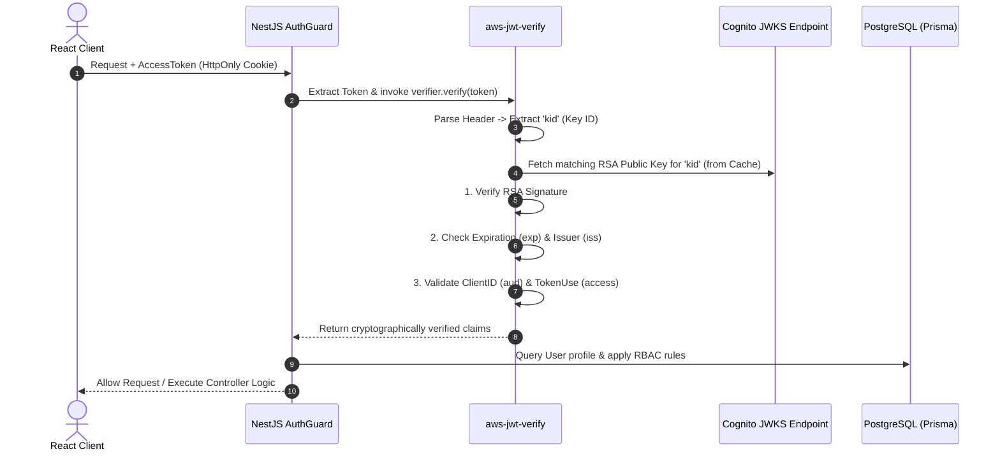
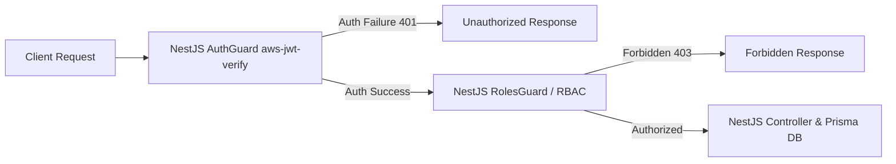

## 1. Introduction

In [Part 1 of this series](../3.1-blog1/), we examined why routing authentication requests through a trusted backend server (**Backend-Mediated Authentication**) represents the appropriate architectural choice for the **Startups Blogs** platform to safeguard the `COGNITO_CLIENT_SECRET` and manage sessions via HttpOnly cookies.

However, routing client traffic through NestJS is only half of the security equation. The backend server itself must execute two essential cryptographic verification mechanisms:

1. **Authenticating Backend Requests to Cognito:** When calling Cognito APIs, the backend must prove it possesses the client secret by computing a **Cognito SecretHash**.
2. **Cryptographic Verification of JWT Signatures:** Upon receiving client requests, the backend must verify token integrity and validate the cryptographic signature issued by Cognito before trusting payload claims to query PostgreSQL.

This article delves into the technical details of computing **SecretHash using HMAC-SHA256**, highlights the critical dangers of relying solely on unverified `jwt.decode()`, and provides an implementation guide for validating Cognito JWTs using **`aws-jwt-verify`** and **JWKS (JSON Web Key Set)** in NestJS.

---

## 2. What Is Cognito SecretHash?

When an Amazon Cognito App Client is configured as a **Confidential Client** (with a `Client Secret` enabled), Cognito requires that requests sent to sensitive authentication APIs (such as `AdminInitiateAuth`, `SignUp`, `ConfirmSignUp`, and `ForgotPassword`) include a `SecretHash` parameter.

### Mathematical Formula for SecretHash

`SecretHash` is a Base64-encoded Keyed-Hash Message Authentication Code (HMAC) computed according to the formula:

$$\text{SecretHash} = \text{Base64}\left( \text{HMAC-SHA256}\left( \text{key} = \text{ClientSecret}, \text{message} = \text{Username} + \text{ClientId} \right) \right)$$

### Element Breakdown:

- **`ClientSecret` (Key):** The confidential key generated by Cognito for the App Client, stored strictly on the NestJS backend.
- **`Username` (Message Part 1):** The user's account username or email address submitted in the payload.
- **`ClientId` (Message Part 2):** The public App Client ID issued by Cognito.
- **`HMAC-SHA256`:** A secret-key cryptographic hash algorithm.
- **`Base64`:** String encoding for transmitting the binary digest over HTTP headers or JSON bodies.

---

## 3. SecretHash Implementation in NestJS / Node.js

Below is a TypeScript implementation of the `SecretHash` generator using Node.js's built-in `crypto` module within a NestJS service:

```typescript
import { createHmac } from "crypto";

/**
 * Generates Cognito SecretHash for a Confidential App Client
 * @param username Account username or email
 * @param clientId Cognito App Client ID
 * @param clientSecret Cognito App Client Secret
 * @returns Base64 encoded SecretHash string
 */
export function generateSecretHash(
  username: string,
  clientId: string,
  clientSecret: string,
): string {
  return createHmac("sha256", clientSecret)
    .update(username + clientId)
    .digest("base64");
}
```

> 💡 **Note:** The `clientId` and `clientSecret` variables are loaded from backend environment variables (`COGNITO_CLIENT_ID` and `COGNITO_CLIENT_SECRET`) via NestJS ConfigService and must never be hardcoded.

---

## 4. What SecretHash Actually Protects

It is essential to understand the technical boundary of what `SecretHash` protects:

- **Proves Possession of Client Secret:** `SecretHash` proves to Cognito that the API request originates from an authorized backend server holding the valid `Client Secret`.
- **Prevents App Client Impersonation:** If an attacker obtains a public `COGNITO_CLIENT_ID`, they cannot issue valid API calls to confidential endpoints without computing a matching `SecretHash`.

> ⚠️ **Technical Security Clarification:**
>
> - `SecretHash` **DOES NOT replace HTTPS/TLS transport encryption**.
> - The one-way nature of HMAC-SHA256 does not render intercepted network requests "harmless" in the absence of TLS. Without HTTPS, eavesdroppers can capture raw credentials (`Password`) or OTP codes present in the HTTP request body.
> - **HTTPS/TLS** protects data confidentiality during transport, whereas **SecretHash** authenticates client application identity to Cognito. Both mechanisms address distinct security concerns and must be deployed together.

---

## 5. Structure of a JSON Web Token (JWT)

Upon successful authentication, Amazon Cognito returns JWT instances comprising three dot-separated sections (`.`):

$$\text{JWT} = \text{HEADER} . \text{PAYLOAD} . \text{SIGNATURE}$$

1. **Header:** Contains metadata regarding the signature algorithm (e.g., `alg: "RS256"`) and Key ID (`kid: "key-id-123"`).
2. **Payload:** Contains identity claims (`sub` user UUID, `email`, `iss` issuer, `exp` expiration timestamp, `token_use` claim).
3. **Signature:** Cryptographic proof generated by Amazon Cognito using its **Private Key** over the combined Header and Payload.

---

## 6. Why `jwt.decode()` Is Dangerous for Authentication

A common security anti-pattern involves parsing incoming JWTs using `jwt.decode(token)` inside NestJS guards and directly trusting `user.id` or `user.role` payload claims to query application databases.

```typescript
// ❌ DANGEROUS SECURITY ANTI-PATTERN - NEVER USE FOR AUTHENTICATION!
const payload = jwt.decode(token); // Only parses Base64URL string; DOES NOT VERIFY SIGNATURE!
const userId = payload.sub;
```

### Vulnerability Analysis:

- **Base64URL Is Not Encryption:** JWT Headers and Payloads are simply Base64URL encoded data strings. Anyone can decode them (`jwt.decode`) using simple script utilities.
- **Payload Forgery Risk:** Malicious actors can construct arbitrary JSON objects containing forged claims (`sub: "admin-uuid"` or `role: "ADMIN"`), encode them in Base64URL, and submit them in requests.
- If a server relies solely on `jwt.decode()`, it unconditionally trusts unverified payloads, allowing attackers to elevate privileges and bypass system security.
- **Conclusion:** `jwt.decode()` parses readable data but **DOES NOT ESTABLISH TRUST OR VERIFY AUTHENTICITY**.


_Figure 1. JWT Verification Comparison in Backend (Unsafe jwt.decode() vs. Secure aws-jwt-verify RSA Signature & JWKS)._

---

## 7. Standard JWT Signature Verification Process with Amazon Cognito

To ensure a token was genuinely issued by Cognito and remains unaltered, NestJS must execute cryptographic verification:



---

## 8. What Is JWKS (JSON Web Key Set)?

Amazon Cognito uses the **RS256 (RSA Signature with SHA-256)** asymmetric algorithm:

- **Private Key:** Kept strictly confidential within AWS Cognito infrastructure to sign issued tokens.
- **Public Keys:** Published publicly by Cognito in a structured JSON Web Key Set (JWKS) at a well-known endpoint:

$$\text{JWKS URL} = \text{https://cognito-idp.us-east-1.amazonaws.com/\{USER\_POOL\_ID\}/.well-known/jwks.json}$$

### Verification Mechanics:

1. Each Public Key in the JWKS possesses a unique identifier called `kid` (Key ID).
2. Upon receiving a token, `aws-jwt-verify` inspects `kid` in the token header and selects the matching public key from the cached JWKS.
3. The library uses the RSA public key to verify whether the signature was created by Cognito's private key.
4. Public keys are **automatically cached in memory** by the library to prevent unnecessary network calls per request.

---

## 9. Implementation Guide using `aws-jwt-verify` in NestJS

Rather than writing custom RSA verification code prone to security flaws, AWS recommends using the official **`aws-jwt-verify`** library.

```typescript
import {
  Injectable,
  CanActivate,
  ExecutionContext,
  UnauthorizedException,
} from "@nestjs/common";
import { ConfigService } from "@nestjs/config";
import { CognitoJwtVerifier } from "aws-jwt-verify";

@Injectable()
export class CognitoAuthGuard implements CanActivate {
  private verifier;

  constructor(private configService: ConfigService) {
    // Configure CognitoJwtVerifier with User Pool parameters
    this.verifier = CognitoJwtVerifier.create({
      userPoolId: this.configService.get<string>("COGNITO_USER_POOL_ID"),
      tokenUse: "access",
      clientId: this.configService.get<string>("COGNITO_CLIENT_ID"),
    });
  }

  async canActivate(context: ExecutionContext): Promise<boolean> {
    const request = context.switchToHttp().getRequest();
    const token = request.cookies["access_token"]; // Extract from HttpOnly Cookie

    if (!token) {
      throw new UnauthorizedException(
        "Authentication token missing from request cookies",
      );
    }

    try {
      // Cryptographically verify RSA signature and validate claim constraints
      const payload = await this.verifier.verify(token);

      // Attach validated user claims to Request object
      request.user = {
        cognitoSub: payload.sub,
        username: payload.username,
      };

      return true;
    } catch (error) {
      throw new UnauthorizedException(
        "Invalid or expired authentication token",
      );
    }
  }
}
```

---

## 10. Critical Claims Validated During Verification

When `aws-jwt-verify` runs, the following security checks are enforced:

1. **RSA Signature:** Ensures the signature matches Header and Payload data using the JWKS RSA public key.
2. **Expiration (`exp` claim):** Rejects tokens if current timestamp exceeds `exp`.
3. **Token Purpose (`token_use` claim):** Differentiates between `access` and `id` tokens. If an API expects an access token, submitting an ID token triggers rejection.
4. **App Client ID (`client_id` / `aud` claim):** Confirms the token was issued specifically for the application's `COGNITO_CLIENT_ID`.
5. **Issuer Claim (`iss` claim):** Validates that the issuer string matches the expected User Pool URL (`https://cognito-idp.us-east-1.amazonaws.com/{USER_POOL_ID}`).

---

## 11. NestJS Request Pipeline: Authentication vs. Authorization



- **Authentication ("Who are you?"):** Handled by `CognitoAuthGuard` and `aws-jwt-verify`. Validates identity authenticity using cryptographic signatures.
- **Authorization ("What are you allowed to do?"):** Handled by `RolesGuard`. Checks application roles (`BUSINESS_OWNER`, `INVESTOR`, `ENTERPRISE_PARTNER`, `ADMIN`) against database entity permissions.

---

## 12. Handling Verification Failures

When token validation fails (due to tampering, expiration, incorrect issuer, or client mismatch):

- NestJS blocks the request at the Guard layer and returns an **HTTP 401 Unauthorized** error.
- Internal exception stack traces are sanitized to avoid leaking security implementation details.
- Security events are recorded in sanitized server logs for audit monitoring.

---

## 13. Common Security Anti-Patterns to Avoid

1. ❌ **Anti-Pattern 1:** Trusting claims from `jwt.decode()` without verifying signatures.
2. ❌ **Anti-Pattern 2:** Checking `exp` while ignoring RSA signature validation.
3. ❌ **Anti-Pattern 3:** Hardcoding Client Secrets or User Pool IDs in source files.
4. ❌ **Anti-Pattern 4:** Accepting `IdToken` in place of `AccessToken` for data mutation APIs.
5. ❌ **Anti-Pattern 5:** Omitting `iss` (Issuer) and `client_id` validation checks.
6. ❌ **Anti-Pattern 6:** Logging raw JWT strings or user credentials in application logs.
7. ❌ **Anti-Pattern 7:** Downloading JWKS keys manually per request without caching.

---

## 14. Layered Defense Architecture (Defense in Depth)

The complete security architecture for **Startups Blogs** utilizes layered defense controls:

$$\text{Browser (React)} \xrightarrow{\text{HTTPS / TLS}} \text{NestJS Backend} \xrightarrow{\text{SecretHash HMAC}} \text{Amazon Cognito}$$
$$\text{NestJS Backend} \xleftarrow{\text{RS256 Public Key (JWKS)}} \text{aws-jwt-verify} \xrightarrow{\text{RolesGuard RBAC}} \text{PostgreSQL (Prisma)}$$

---

## 15. Conclusion

Securing authentication extends beyond concealing the `COGNITO_CLIENT_SECRET` on a backend server. It requires computing **SecretHash HMAC-SHA256** for backend API calls and **cryptographically verifying JWT signatures using `aws-jwt-verify` and JWKS**. Implementing these standards ensures that **Startups Blogs** operates securely, reliably, and ready for production deployment.

---

### Key Takeaways

1. **SecretHash Authenticates the Backend Server:** Computing `HMAC-SHA256(ClientSecret, Username + ClientId)` proves to Cognito that NestJS is an authorized confidential server.
2. **`jwt.decode()` Is Not Verification:** Decoding Base64 strings does not verify token integrity; never trust unverified claims.
3. **RSA Signature Verification via JWKS:** Use `aws-jwt-verify` to automatically match RSA public keys from Cognito User Pool JWKS endpoints.
4. **Multi-Claim Validation:** Ensure signature, expiration (`exp`), token use (`token_use`), issuer (`iss`), and client ID (`client_id`) are validated simultaneously.

---

### Authentication Security Series

- [Part 1: Why Should Authentication Requests Go Through the Backend? – Amazon Cognito with React and NestJS](../3.1-blog1/)
- **Part 2: Securing Amazon Cognito Authentication: SecretHash and JWT Signature Verification – Part 2**
- [Part 3: Secure Session Management: HttpOnly Cookies, Refresh Tokens, and RBAC – Part 3](../3.3-blog3/)

---

### Original Post

[View the original post on Facebook](https://www.facebook.com/photo/?fbid=1059870846748835&set=gm.2242621059836187&idorvanity=660548818043427)

