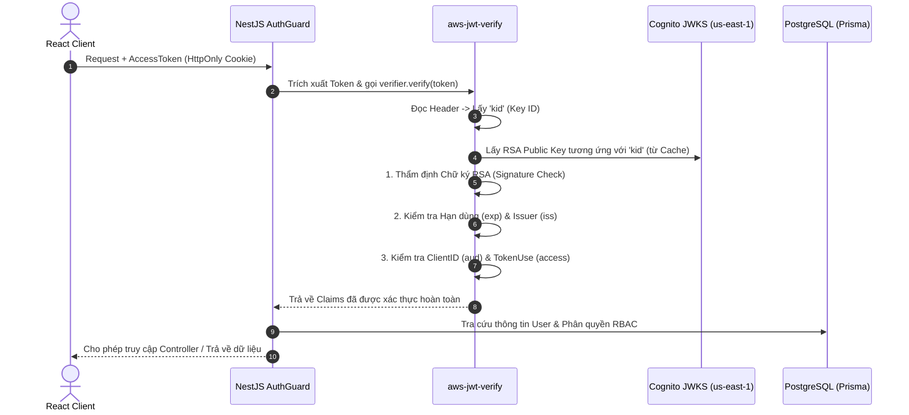
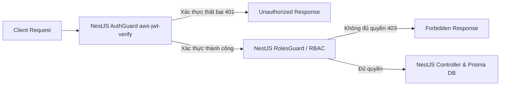

## 1. Giới thiệu bài viết

Trong [Phần 1 bài viết](../3.1-blog1/), chúng ta đã phân tích lý do tại sao kiến trúc xác thực qua Server trung gian (**Backend-Mediated Authentication**) là quyết định đúng đắn cho dự án **Startups Blogs** để bảo vệ `COGNITO_CLIENT_SECRET` và quản lý phiên làm việc bằng HttpOnly Cookies.

Tuy nhiên, việc điều hướng request qua NestJS Backend mới chỉ là một nửa của bài toán bảo mật. Bản thân NestJS Server cũng phải thực hiện hai cơ chế an ninh quan trọng:

1. **Chứng minh quyền với Cognito:** Khi gọi các API của Cognito, Backend phải chứng minh mình nắm giữ `Client Secret` thông qua mã **Cognito SecretHash**.
2. **Thẩm định chữ ký số của JWT:** Khi nhận request từ trình duyệt, Backend phải kiểm tra tính toàn vẹn và thẩm định chữ ký mã hóa của JWT phát hành bởi Cognito trước khi truy vấn dữ liệu từ PostgreSQL.

Bài viết này sẽ đi sâu vào chi tiết kỹ thuật tính toán **SecretHash bằng thuật toán HMAC-SHA256**, tác hại nghiêm trọng của việc chỉ dùng `jwt.decode()` đơn thuần, và hướng dẫn triển khai thẩm định chữ ký JWT chuẩn mực bằng thư viện **`aws-jwt-verify`** kết hợp tập khóa công khai **JWKS (JSON Web Key Set)** trên NestJS.

---

## 2. Cognito SecretHash là gì?

Khi Amazon Cognito App Client được cấu hình ở chế độ **Confidential Client** (có bật `Client Secret`), Cognito yêu cầu mọi request gửi đến các API xác thực nhạy cảm (như `AdminInitiateAuth`, `SignUp`, `ConfirmSignUp`, `ForgotPassword`) phải kèm theo tham số `SecretHash`.

### Công thức toán học tính SecretHash

`SecretHash` là một chuỗi mã hóa Băm có khóa (Keyed-Hash Message Authentication Code) được tính toán theo công thức:

$$\text{SecretHash} = \text{Base64}\left( \text{HMAC-SHA256}\left( \text{key} = \text{ClientSecret}, \text{message} = \text{Username} + \text{ClientId} \right) \right)$$

### Giải thích các thành phần:

- **`ClientSecret` (Key):** Chuỗi bí mật do Cognito tạo ra cho App Client, chỉ lưu trên server NestJS.
- **`Username` (Message Part 1):** Tên đăng nhập hoặc Email của người dùng gửi lên trong request.
- **`ClientId` (Message Part 2):** ID định danh công khai của Cognito App Client.
- **`HMAC-SHA256`:** Thuật toán mã hóa băm một chiều sử dụng khóa bí mật.
- **`Base64`:** Định dạng mã hóa chuỗi kết quả để gửi qua HTTP header hoặc JSON payload.

---

## 3. Ví dụ cài đặt SecretHash trong NestJS / Node.js

Dưới đây là đoạn mã TypeScript triển khai hàm tính toán `SecretHash` sử dụng module mã hóa tích hợp `crypto` của Node.js trong NestJS Service:

```typescript
import { createHmac } from "crypto";

/**
 * Tính toán Cognito SecretHash cho Confidential App Client
 * @param username Tên người dùng hoặc Email
 * @param clientId Cognito App Client ID
 * @param clientSecret Cognito App Client Secret
 * @returns Chuỗi SecretHash đã mã hóa Base64
 */
export function generateSecretHash(
  username: string,
  clientId: string,
  clientSecret: string,
): string {
  return createHmac("sha256", clientSecret)
    .update(username + clientId)
    .digest("base64");
}
```

> 💡 **Lưu ý:** Các tham số `clientId` và `clientSecret` được đọc từ biến môi trường `COGNITO_CLIENT_ID` và `COGNITO_CLIENT_SECRET` của NestJS ConfigService, không được ghi cứng (hardcode) trong mã nguồn.

---

## 4. SecretHash thực sự bảo vệ điều gì?

Cần hiểu chính xác về mặt kỹ thuật phạm vi bảo vệ của `SecretHash`:

- **Chứng minh quyền sở hữu Client Secret:** `SecretHash` chứng minh với Cognito rằng request thực sự xuất phát từ NestJS Backend của ứng dụng – nơi nắm giữ `Client Secret` hợp lệ.
- **Ngăn chặn giả mạo Client ID:** Nếu kẻ tấn công lấy được `COGNITO_CLIENT_ID` (vốn là thông tin công khai), chúng vẫn không thể tự tạo request hợp lệ đến Cognito nếu không tính toán được `SecretHash` chính xác.

> ⚠️ **Đính chính quan điểm sai lầm về an ninh:**
>
> - `SecretHash` **KHÔNG THỂ thay thế cho kết nối mã hóa HTTPS/TLS**.
> - Việc thuật toán HMAC-SHA256 là hàm băm một chiều không có nghĩa là một request bị bắt chặn trên mạng là "hoàn toàn vô hại". Nếu không có HTTPS, kẻ tấn công trên mạng vẫn có thể đánh cắp mật khẩu thô (`Password`) hoặc mã OTP nằm trong body của request.
> - **HTTPS/TLS** bảo vệ tính bảo mật của dữ liệu trên đường truyền, còn **SecretHash** bảo vệ việc xác thực danh tính của ứng dụng client phía server. Hai cơ chế này giải quyết hai bài toán an ninh khác nhau và bắt buộc phải được áp dụng đồng thời.

---

## 5. Cấu trúc của định dạng mã JWT (JSON Web Token)

Khi Cognito xác thực thành công, nó trả về token dạng JWT gồm 3 phần phân tách bởi dấu chấm (`.`):

$$\text{JWT} = \text{HEADER} . \text{PAYLOAD} . \text{SIGNATURE}$$

1. **Header (Phần đầu):** Chứa thông tin về thuật toán mã hóa (vd: `alg: "RS256"`) và ID của khóa ký (`kid: "key-id-123"`).
2. **Payload (Thân token):** Chứa các thông tin nhận dạng (Claims) như `sub` (User UUID), `email`, `iss` (Issuer), `exp` (Thời điểm hết hạn), `token_use` (`access` hoặc `id`).
3. **Signature (Chữ ký số):** Đoạn mã hóa tạo bởi Amazon Cognito sử dụng **Khóa tư nhân (Private Key)** của User Pool để ký lên toàn bộ phần Header và Payload.

---

## 6. Tại sao sử dụng `jwt.decode()` để xác thực lại cực kỳ nguy hiểm?

Rất nhiều lập trình viên mới gặp sai lầm khi viết NestJS Guard bằng cách gọi hàm `jwt.decode(token)` rồi lấy ngay thông tin `user.id` hay `user.role` từ payload để truy vấn database.

```typescript
// ❌ CỰC KỲ NGUY HIỂM - KHÔNG BAO GIỜ DÙNG TRONG PRODUCTION!
const payload = jwt.decode(token); // Chỉ giải mã chuỗi Base64URL, KHÔNG KIỂM TRA CHỮ KÝ!
const userId = payload.sub;
```

### Phân tích lỗ hổng kỹ thuật:

- **Base64URL không phải là Mã hóa (Not Encryption):** Phần Header và Payload của JWT chỉ được mã hóa dạng Base64URL để truyền tải dữ liệu, bất kỳ ai cũng có thể giải mã (`jwt.decode`) bằng một dòng lệnh đơn giản.
- **Dễ dàng giả mạo Payload (Token Forgery):** Kẻ tấn công có thể tạo một đoạn JSON chứa `sub: "admin-uuid"` hoặc `role: "ADMIN"`, mã hóa Base64URL và gửi lên server.
- Nếu server chỉ dùng `jwt.decode()`, nó sẽ tin tưởng hoàn toàn dữ liệu giả mạo này và cấp quyền truy cập trái phép vào toàn bộ hệ thống!
- **Kết luận:** `jwt.decode()` chỉ giúp đọc dữ liệu nhưng **KHÔNG CHỨM MINH ĐƯỢC TÍNH TOÀN VẸN VÀ NGUỒN GỐC HỢP PHÁP** của token.


_Hình 1. So sánh Thẩm định JWT trong Backend (Chỉ jwt.decode() không an toàn vs. aws-jwt-verify thẩm định chữ ký RSA & JWKS)._

---

## 7. Quy trình thẩm định chữ ký JWT chuẩn mực với Amazon Cognito

Để đảm bảo token thực sự do Cognito phát hành và chưa bị chỉnh sửa, NestJS Backend phải thẩm định chữ ký số theo quy trình:



---

## 8. JWKS (JSON Web Key Set) là gì?

Amazon Cognito sử dụng thuật toán bất đối xứng **RS256 (RSA Signature with SHA-256)**:

- **Private Key (Khóa tư nhân):** Được giữ kín tuyệt đối bên trong hệ thống AWS Cognito để ký các JWT.
- **Public Keys (Khóa công khai):** Được Cognito công bố công khai dưới dạng một danh sách cấu trúc JSON gọi là **JWKS (JSON Web Key Set)** tại đường dẫn cố định:

$$\text{URL JWKS} = \text{https://cognito-idp.us-east-1.amazonaws.com/\{USER\_POOL\_ID\}/.well-known/jwks.json}$$

### Cách thức hoạt động:

1. Mỗi Public Key trong tập JWKS có một định danh duy nhất gọi là `kid` (Key ID).
2. Khi JWT được gửi tới, thư viện kiểm tra sẽ đọc `kid` trong Header của JWT, tìm Public Key tương ứng từ JWKS.
3. Sử dụng Public Key đó để thẩm định xem chữ ký (Signature) có đúng được tạo ra từ Private Key của Cognito hay không.
4. Thư viện sẽ **tự động cache tập RSA Public Keys** để tránh việc phải tải lại JWKS qua mạng trong mỗi request, tối ưu hiệu năng tối đa.

---

## 9. Cài đặt chuẩn mực với thư viện `aws-jwt-verify` trong NestJS

Thay vì tự viết mã thẩm định RSA phức tạp dễ phát sinh lỗ hổng an ninh, giải pháp chuẩn hóa được AWS khuyến nghị là sử dụng thư viện chính thức **`aws-jwt-verify`**.

```typescript
import {
  Injectable,
  CanActivate,
  ExecutionContext,
  UnauthorizedException,
} from "@nestjs/common";
import { ConfigService } from "@nestjs/config";
import { CognitoJwtVerifier } from "aws-jwt-verify";

@Injectable()
export class CognitoAuthGuard implements CanActivate {
  private verifier;

  constructor(private configService: ConfigService) {
    // Khởi tạo CognitoJwtVerifier với cấu hình User Pool
    this.verifier = CognitoJwtVerifier.create({
      userPoolId: this.configService.get<string>("COGNITO_USER_POOL_ID"),
      tokenUse: "access",
      clientId: this.configService.get<string>("COGNITO_CLIENT_ID"),
    });
  }

  async canActivate(context: ExecutionContext): Promise<boolean> {
    const request = context.switchToHttp().getRequest();
    const token = request.cookies["access_token"]; // Trích xuất từ HttpOnly Cookie

    if (!token) {
      throw new UnauthorizedException(
        "Không tìm thấy token xác thực trong Cookie",
      );
    }

    try {
      // Thẩm định toán học chữ ký RSA và các kiểm tra an toàn tự động
      const payload = await this.verifier.verify(token);

      // Gắn thông tin User đã thẩm định vào Request object
      request.user = {
        cognitoSub: payload.sub,
        username: payload.username,
      };

      return true;
    } catch (error) {
      throw new UnauthorizedException("Token không hợp lệ hoặc đã hết hạn");
    }
  }
}
```

---

## 10. Các tiêu chí kiểm tra bắt buộc khi thẩm định JWT

Khi `aws-jwt-verify` thực hiện thẩm định, các tiêu chí an ninh sau bắt buộc phải thỏa mãn:

1. **Chữ ký mã hóa (RSA Signature):** Đảm bảo Signature khớp hoàn toàn với Header + Payload bằng Public Key từ JWKS.
2. **Thời hạn hiệu lực (`exp` claim):** Từ chối ngay lập tức nếu thời gian hiện tại lớn hơn `exp` (Expired Token).
3. **Mục đích sử dụng (`token_use` claim):** Phân biệt rõ `access` token và `id` token. Nếu endpoint API yêu cầu `access` token mà người dùng truyền `id` token, request sẽ bị từ chối.
4. **Định danh Client (`client_id` / `aud` claim):** Xác nhận token được phát hành đúng cho `COGNITO_CLIENT_ID` của ứng dụng Startups Blogs.
5. **Nhà phát hành (`iss` claim):** Xác nhận token xuất phát chính xác từ User Pool URL (`https://cognito-idp.us-east-1.amazonaws.com/{USER_POOL_ID}`).

---

## 11. Luồng xử lý request trong NestJS: Phân biệt Authentication và Authorization



- **Authentication (Xác thực - Bạn là ai?):** Do `CognitoAuthGuard` và `aws-jwt-verify` đảm nhận. Xác minh tính hợp pháp của danh tính qua chữ ký JWT.
- **Authorization (Phân quyền - Bạn được làm gì?):** Do `RolesGuard` đảm nhận. Kiểm tra vai trò (`BUSINESS_OWNER`, `INVESTOR`, `ENTERPRISE_PARTNER`, `ADMIN`) xem người dùng có quyền thực thi thao tác nghiệp vụ trong cơ sở dữ liệu hay không.

---

## 12. Xử lý khi thẩm định thất bại

Nếu token gửi lên không vượt qua được khâu kiểm tra (token bị sửa đổi, hết hạn, sai issuer hoặc không đúng app client):

- NestJS lập tức chặn request tại tầng Guard và trả về mã lỗi **HTTP 401 Unauthorized**.
- Không trả về thông tin chi tiết kỹ thuật lỗi nội bộ ra bên ngoài để tránh lộ diện cơ chế phòng thủ cho kẻ tấn công.
- Ghi log sự cố an ninh (sanitized log) tại server để theo dõi các hành vi truy cập bất thường.

---

## 13. Các sai lầm bảo mật phổ biến cần tránh

1. ❌ **Sai lầm 1:** Sử dụng `jwt.decode()` để tin tưởng thông tin người dùng mà không kiểm tra chữ ký.
2. ❌ **Sai lầm 2:** Chỉ kiểm tra thời hạn hết hạn `exp` mà bỏ qua kiểm tra chữ ký RSA.
3. ❌ **Sai lầm 3:** Ghi cứng (hardcode) Client Secret hoặc User Pool ID trong mã nguồn.
4. ❌ **Sai lầm 4:** Nhầm lẫn và chấp nhận `IdToken` thay thế cho `AccessToken` cho các API làm thay đổi dữ liệu.
5. ❌ **Sai lầm 5:** Bỏ qua việc kiểm tra `iss` (Issuer) và `client_id`.
6. ❌ **Sai lầm 6:** Ghi log toàn bộ token thô (raw JWT) hoặc mật khẩu ra file log của ứng dụng.
7. ❌ **Sai lầm 7:** Tự viết hàm fetch JWKS thủ công trong từng request thay vì dùng thư viện có sẵn cơ chế caching key.

---

## 14. Mô hình Bảo vệ Nhiều lớp (Defense in Depth)

Tổng kết kiến trúc an ninh xác thực cho dự án Startups Blogs được xây dựng theo mô hình bảo vệ nhiều lớp:

$$\text{Browser (React)} \xrightarrow{\text{HTTPS / TLS}} \text{NestJS Backend} \xrightarrow{\text{SecretHash HMAC}} \text{Amazon Cognito}$$
$$\text{NestJS Backend} \xleftarrow{\text{RS256 Public Key (JWKS)}} \text{aws-jwt-verify} \xrightarrow{\text{RolesGuard RBAC}} \text{PostgreSQL (Prisma)}$$

---

## 15. Kết luận

Bảo mật hệ thống xác thực không chỉ dừng lại ở việc ẩn `COGNITO_CLIENT_SECRET` trên server trung gian NestJS, mà còn nằm ở việc tính toán chính xác **SecretHash HMAC-SHA256** và **thẩm định chữ ký mã hóa của JWT bằng `aws-jwt-verify` và JWKS**. Việc áp dụng đúng đắn các chuẩn mực này giúp nền tảng **Startups Blogs** vận hành an toàn, tin cậy và sẵn sàng cho môi trường Production.

---

### Điểm chính cần nhớ

1. **SecretHash chứng minh thẩm quyền Server:** Mã hóa `HMAC-SHA256(ClientSecret, Username + ClientId)` chứng minh NestJS là server tin cậy được cấp phép gọi Cognito.
2. **`jwt.decode()` không phải xác thực:** Giải mã Base64 không chứng minh được tính toàn vẹn của token; tuyệt đối không tin tưởng dữ liệu từ `jwt.decode()` nếu chưa thẩm định chữ ký.
3. **Thẩm định chữ ký RSA bằng JWKS:** Sử dụng `aws-jwt-verify` để tự động đối chiếu RSA Public Keys từ đường dẫn JWKS của Cognito User Pool.
4. **Kiểm tra đa tiêu chí:** Bắt buộc kiểm tra đồng thời chữ ký RSA, thời hạn `exp`, mục đích `token_use`, nhà phát hành `iss` và client ID `client_id`.

---

### Loạt bài bảo mật xác thực

- [Phần 1: Tại sao không nên gọi trực tiếp API xác thực từ Frontend? – Amazon Cognito với React và NestJS](../3.1-blog1/)
- **Phần 2: Bảo mật xác thực Cognito: SecretHash và thẩm định chữ ký JWT – Phần 2**
- [Phần 3: Quản lý phiên đăng nhập an toàn: HttpOnly Cookies, Refresh Token và Phân quyền RBAC – Phần 3](../3.3-blog3/)

---

### Bài viết gốc

[Bài viết trên Facebook](https://www.facebook.com/photo/?fbid=1059870846748835&set=gm.2242621059836187&idorvanity=660548818043427)

